# Active Directory Domain Services

This module should be shared with learners upon completion of the accompanying [slide deck](https://docs.google.com/presentation/d/1mZOhjozuktjvsOcqqtY-xXtdaJhicm1sH1FtjBMJq9M/edit?usp=sharing).

## Windows Servers

Similar to Microsoft's market dominance in productivity applications with Office365 (Now Microsoft365), they also make some of the most popular software for managing your IT infrastructure, including users and devices. As discussed in the preceding presentation, one of the most significant software suites offered is Active Directory, and it's related features. 

Active Directory is typically installed on a Windows Server, so that's where we need to start.

As we mentioned in the presentation, there are several ways to install a Server, the quickest way is to attach an existing, pre-installed virtual hard disk (VHD), or you could also install to a blank VM from an ISO. 

This tutorial is going to use Windows Server 2022, and both VHD and ISO can be downloaded from here:  
[Windows Server 2022 download](https://www.microsoft.com/en-us/evalcenter/download-windows-server-2022)

If installing from an `ISO` you will have to go through the installation process, if using an existing `VHD`, you will just be asked to set a password for your administrator account before landing at the desktop.

For this demo I used the VHD option, created a new virtual machine, selected `Use an Existing Virtual Hard Disk File`, and pointed it to the downloaded VHD.

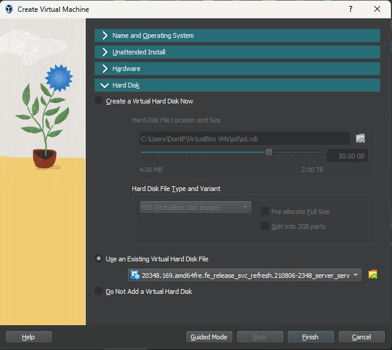

### Installing Roles and Features

***Please note -  the following processes may take a while, especially if your VirtualBox installation is using software-based virtualisation, i.e. you have the little green turtle on the status bar***

Install the necessary files and services for the server to act as a Domain Controller by selecting `Manage` > `Add Roles & Features` from the top right of `Server Manager`

The first page provides a bit of information & guidance, the next asks whether you want to set up virtual desktop infrastructure (VDI), and on the third you can select which server you want to configure, but we only have one. Just leave all of these settings as default, and click next until you see the list of roles.

When you select `Active Directory Domain Service` you will be prompted to add some additional dependencies which you can accept. If you click `Next` you're presented with the list of Features, if you scroll through you'll see the ones which were automatically selected, we don't need to add anything else so just click Next again.

You'll be given a bit more info about Active Directory, then a summary page on which you can click install. 

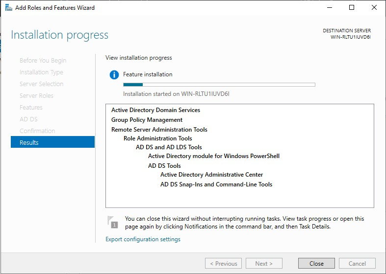

Once installed, on the confirmation page, you will see an option to promote the server to a Domain Controller. You will also find the option listed under the notification flag in the top right.

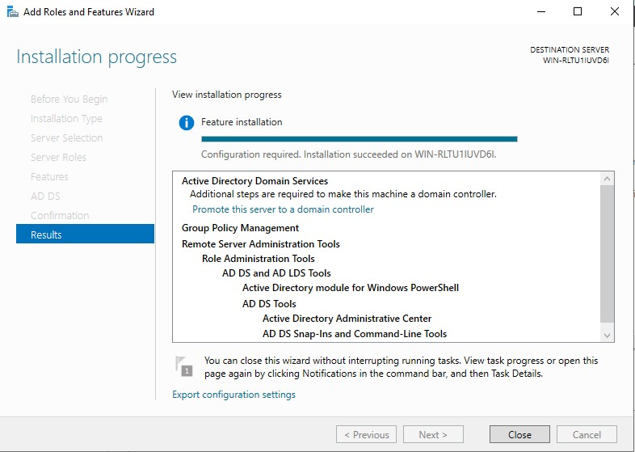

The `Active Directory Domain Services Configuration Wizard` jumps straight into the options need to define, first you need to select whether this will be a new Domain Controller, or work with existing ones. 

As discussed in the presentation, we have three options for how we want to deploy our DC, but only one relevant to us because we don't have an existing domain or forest, which is `Add a new forest`.

On the first page you also need to provide the name of your domain. This could be the public domain you own, but for a private domain you can put anything. It is common for home use or testing & dev' to use a convention like `[something].home` or `[something].test` to make clear it's not a production server.

After clicking Next you're prompted to select the `Functional Level` of the domain and forest. Basically, over time, Microsoft makes changes and adds new features to their server O/S and associated technologies, such as AD. If you have servers running older versions of the O/S, or non-Microsoft apps and devices which may not operate correctly with new version, you can define an older functional level, to maintain compatibility.

Also on this page you have some additional options regarding the DC's capabilities, do not change them, but notice one is that it should also be a DNS server. If we had an existing DNS server you could deselect it, but we don't. 

The last option is to set a `Directory Services Restore Mode (DSRM)` password, which does what you would expect, allows you to restore the directory in the case of corruption or failure.

Next you just have a single option, which allows us to specify the external DNS server if needed, so leave it unselected and move on.

After a moment, the next page will auto-fill a NETBIOS name, this was basically a pre-cursor to DNS and remains for legacy purposes. Don't change it and click Next. 

You are then shown various paths for the data AD relies upon and maintains. If you were deploying multiple DCs you might put this data in a centralised location, but we can accept the defaults.

Finally you'll be given a summary of all of the selected actions, and it will also provide you with the equivalent PowerShell script which can be useful if you need to deploy duplicate servers. 

When you click Next a variety of checks are carried out, you will also likely receieve some warnings. One about the legacy encryption not being supported by default; Another about the lack of a DNS delegation, which we discussed above; There likely also one be about needing a static IP address, we'll fix that later on. However, none of these prevent installation, so you can click `Install`.

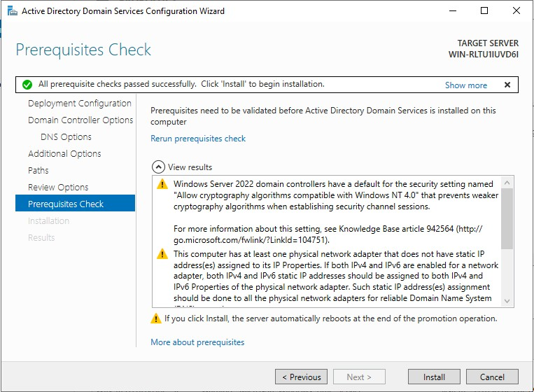

At the end of the installation process the server will restart and it may take a little longer to do so with new settings are applied, but upon completion you will be prompted to log in as normal, with one difference.

    When logging in, if you need to press CTRL+ALT+DEL in VirtualBox it will likely be picked up by your host instead. In your server's VirtualBox terminal use the `input` > `Keyboard` option to send the appropriate key combo' to the VM.

You should now see the name of your domain preceding your username.

When logged in you'll still be presented with Server Manager, there are a few extra options on the left for `AD DS` and `DNS` which will show you logs, but to start building our directory we want to access `Active Directory Users and Computers` from the `Tools` menu.

As discussed previously, you can build a directory to model your organisation in any way you need. When you initially open the window in the left pane there are a range of directories pre-created (you may need to expand your domain). If you click `Computers` there are no devices currently, but in `Domain Controllers` you'll see an object represent the current server you're using (confirm this by viewing the device name of the system), if you had redundant DCs you would see multiple devices here.

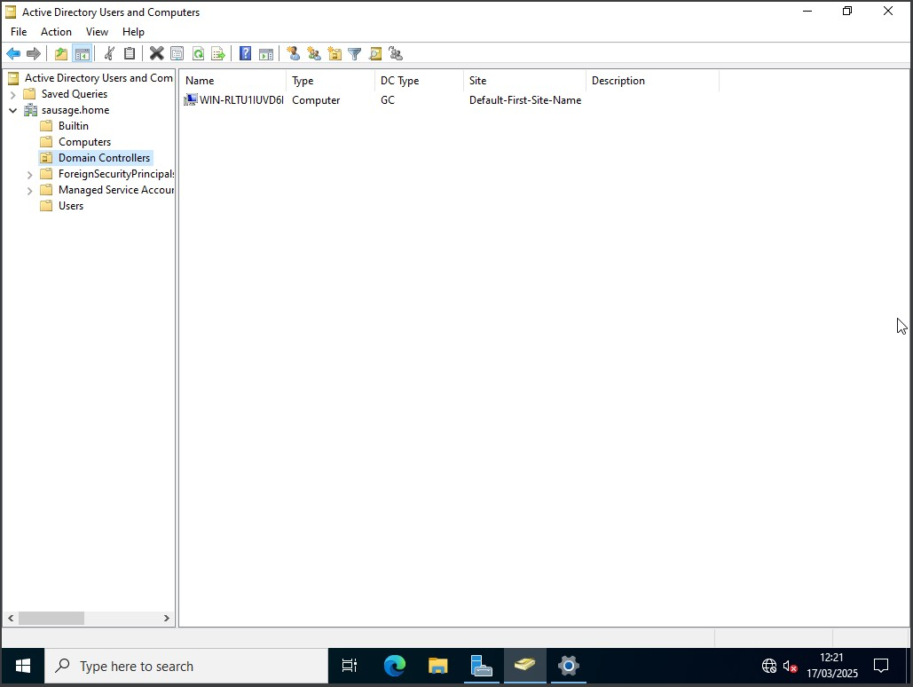

Click on `Users` to see objects representing individual users, currently one the `Administrator`, and a number of built in user-groups which align with common job roles and infrastructure functions.

Of course, as we discussed, you may not want to follow this directory structure, so to personalise it we need to create `Organisational Units` (OUs). These act as containers for organising and modeling your directory needs. 

A common approach is to make OUs representing your different business locations, and then create containers within for your users and computers.

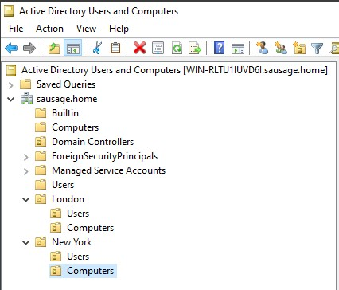

## Adding a Windows Client

At this point we have a domain, and a domain controller, but that's it, it's not controling anything!

The next thing we need to do is deploy a Windows client, and add a domain user who can log into it.

Click to download a [Windows 11 Dev' VM for VirtualBox](https://download.microsoft.com/download/1/4/6/1468925f-d912-4436-8582-4cfdc66e18fc/WinDev2407Eval.VirtualBox.zip)

The download above is for a VirtualBox virtual hard disk, so deploying the client is the same process as I used for Windows Server at the outset, i.e. create a blank VM, and direct it to use the VHD.

Upon booting you'll be prompted to create your user name and password, then land at the desktop. 

At this point we have to take a pause and return to the IP issue that we were warned about when promoting our server to a domain controller. We need our two virtual machines to be able to communicate, so they need to be on the same network. The easiest way to quickly configure this for our testing purposes is to switch the setting in VirtualBox for each individual VM to be using the `internal network`.

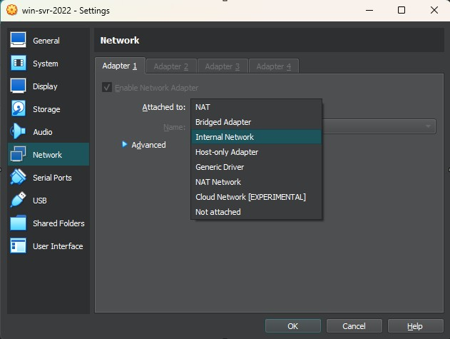

Once both machines are on the `internal network`, we can assign static IPs so that they're in the same address range. 

The two diagrams below show the IP address configuration for the Windows 2022 Server and Windows 11 client. I've chosen to use the CIDR block `10.0.10.0/24`.

Things to note:
- Typically the gateway/router for the network will be given the first available address in the range, which in our case would be `10.0.10.1`. We don't have a gateway so I've left it blank, but I've still given the server the second available address `10.0.10.2/24` just out of habit.
- Our ADDS server is also our DNS server, so the DNS address is set to loopback, i.e. use yourself for DNS. 
- The client has been given the next IP address `10.0.10.3/24`, and the client's DNS is directed to the server.

[server configuration]
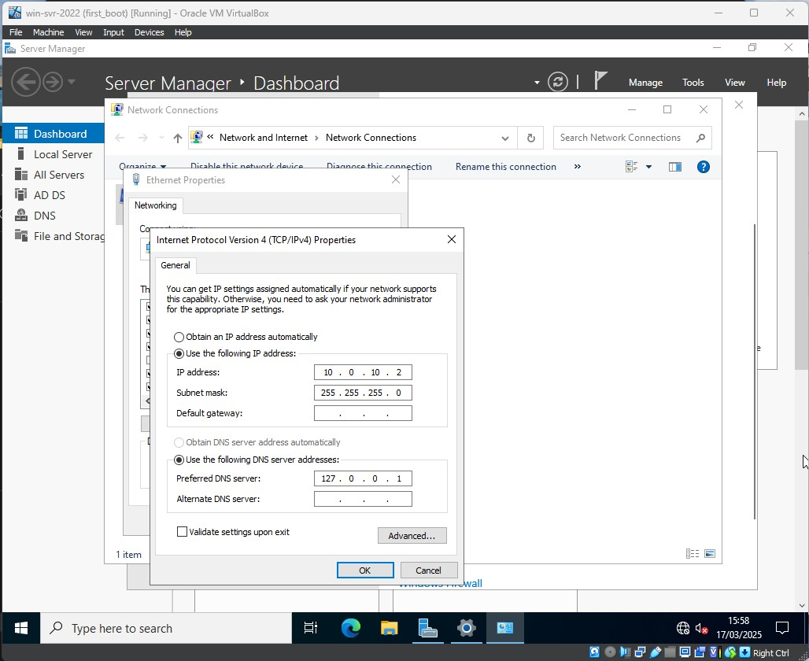
[client configuration]
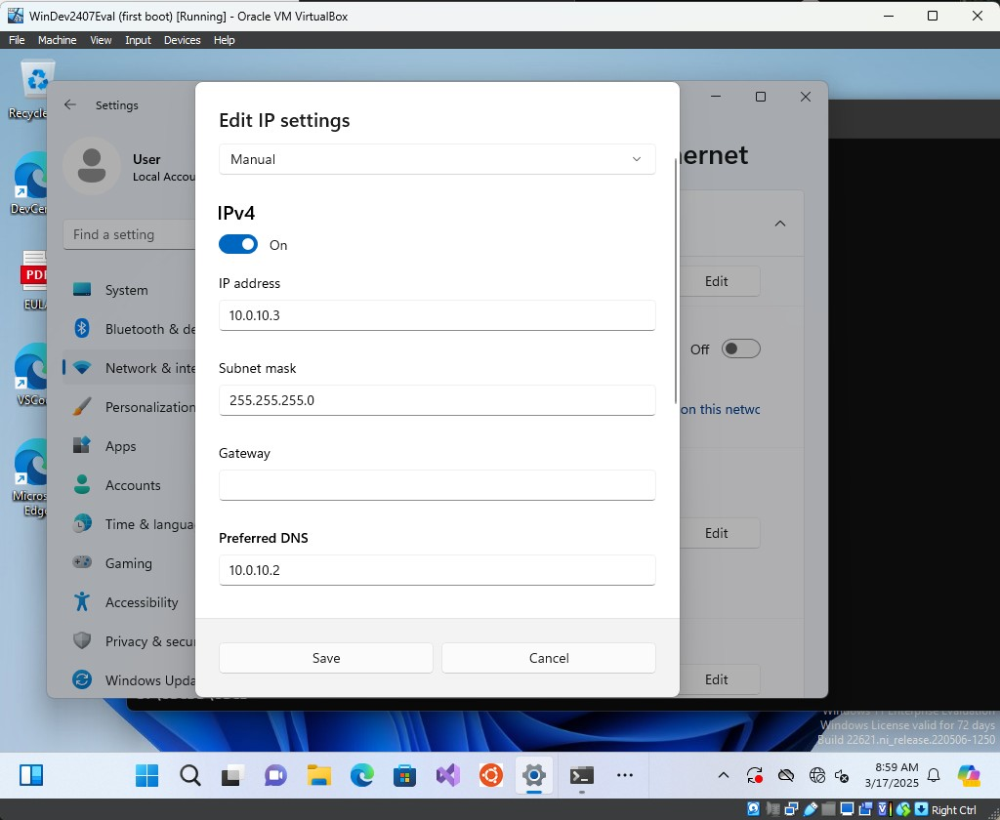

If everything is configured correctly, at this point you should be able to ping the server's IP address from the Command Prompt of the client.

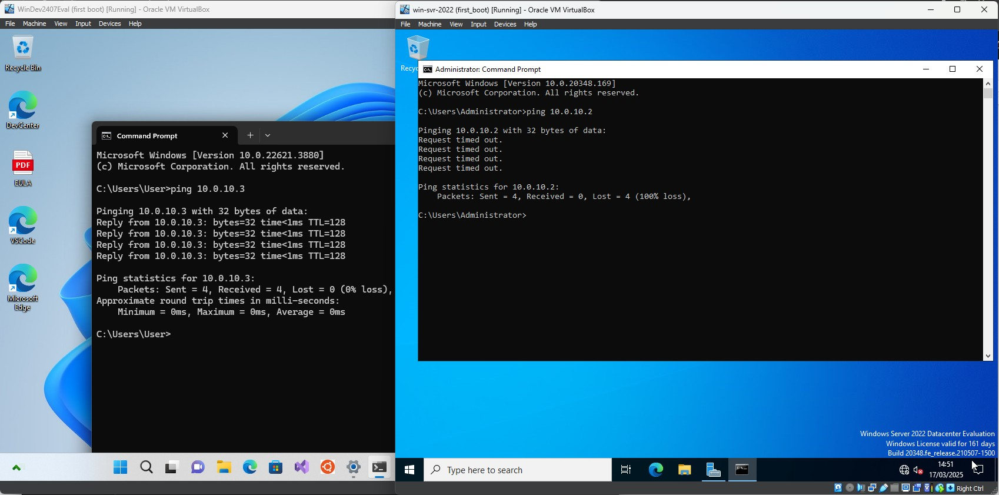

    Mini-Challenge - Notice how the Server > client ping has failed! By default Windows 11 is configured not to respond to pings. Do some research to try and fix this.

Now that the client and server can can communicate, we can add the client to the domain. To do so from the client right click on `Start` and select `System`, then find the option for `Domain or Workgroup`. 

Then select the option to `Change` the domain or workgroup, and then select the `Domain` option, and type in the name you provided when installing Active Directory Domain Services.

When you click ok, cross your fingers, and complete a ritual chant, you should be prompted for a username and password. You should use an account with permission to join the domain, and at this point that's only the `Administrator`.

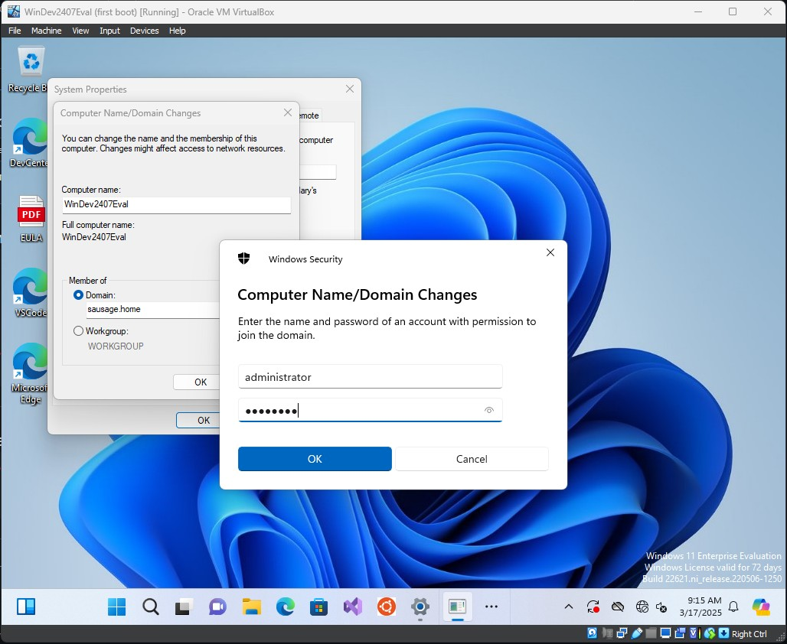

And you're rewarded with a nice polite welcome message, and you will be prompted to 

