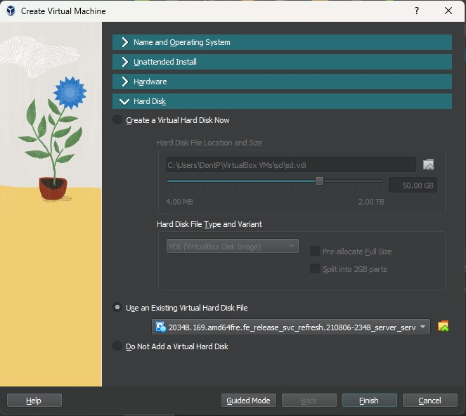

# Installing or Deploying Windows Server

As we mentioned in the presentation, there are several ways to install Windows Server, below are a couple of the quickest and easiest options for learning and experimentation purposes.

## Deploy a Windows Server on AWS

1. Access the Management Console and navigate to the EC2 Dashboard. 
2. Create a new instance with the following coniguration:

- **Name**: `AnyName`
- **AMI**: `Windows Server 2019 Base`
- **Instance Type**: `t2.micro`
- **Key Pair**: NOTE - A `pem` key is required:
  - If using the AWS Sandbox: `vockey`
  - If using a personal AWS account select a `pem` key to which you have access, or generate a new one.
- **Security Group**: Select **Create Security Group** and ensure **Allow RDP traffic from** `Anywhere` is selected.
  - You may also choose an existing Security Group and add an `Allow RDP` rule manually (port: `3389`)
- **Configure Storage**: Keep defaults - `1x 30Gib gp2` 
- Click **Launch Instance**

### Connecting to a Windows Instance

There are a couple of differences when connecting to a Windows instance compared to a Linux one.

We connect to Linux using SSH by default, but Windows uses `Remote Desktop Protocol` (`RDP`) by default, which is designed for remote GUI access. RDP uses port `3389`.

Additionally, user account management is different in Windows, so an `ec2-user` account with `sudo` privileges is not created, instead a Windows `administrator` account and a random password is created for you.

To retrieve the administrator credentials and connect to your instance:

1. Wait for instance' status checks to pass, then select instance and click **connect** then **RDP Client**
2. On the **RDP Client** page select **Connect using RDP client** then **Download remote desktop file**
3. Ensure the **Username** field states `Administrator`, then click the get **password link** at the bottom.
4. You're presented with the **Get Windows password** page, you need to upload your `pem` key in order to verify your identity and decrypt the password:

  - If you're using the AWS Sandbox you can download the `pem` key next to the `ppk` key in the details panel.
  - If you're using a personal AWS Account use the `pem` key you created previously.

5. Once uploaded click **Decrypt password** and copy the revealed password to a text editor.
6. Open the RDP file you downloaded in step 2, accept any trust challenges, and enter the password you copied when prompted.
7. After a few moments you should be presented with a Windows Desktop, but be aware that we've chosen a low powered instance, it may take some time to load.

The Windows Server 2019 desktop looks just like the Windows 10 one, so when you're presented with it, you can return to the [ADDS tutorial](/Deploy-ADDS.md).

## Creating a Windows Server VirtualBox VM

This tutorial is going to use Windows Server 2022, and both VHD and ISO can be downloaded from here:

[Windows Server 2022 download](https://www.microsoft.com/en-us/evalcenter/download-windows-server-2022)

If installing from an `ISO` you will have to go through the installation process, if using a `VHD` then the preinstalled version of Windows has been `sysprepped`, so you will just be asked to set a password for your administrator account before landing at the desktop.

### VHD
Create a new virtual machine
Select `Use an Existing Virtual Hard Disk File`, and point it to the downloaded VHD file

