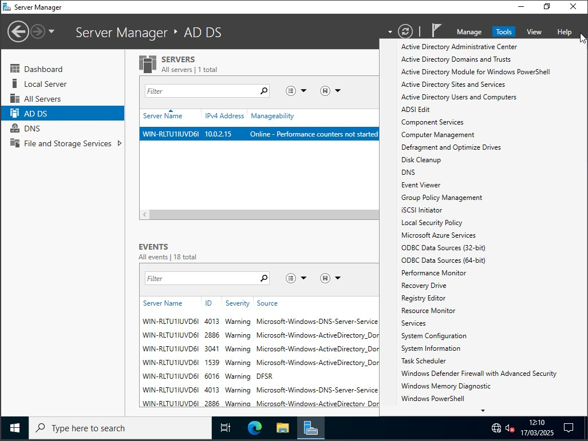

# Active Directory Domain Services

This module should be shared with learners upon completion of the accompanying [slide deck](https://docs.google.com/presentation/d/1mZOhjozuktjvsOcqqtY-xXtdaJhicm1sH1FtjBMJq9M/edit?usp=sharing).

## Windows Servers

Similar to Microsoft's market dominance in productivity applications with Office365 (Now Microsoft365), they also make some of the most popular software for managing your IT environment, including users and devices. As discussed in the preceding presentation, one of the most significant software suites offered is Active Directory, and it's related features.

Active Directory is typically installed on a Windows Server, so that's where we need to start.

[Click here](/deploy_win_svr.md) for the guide on deploying Windows Server

## Installing Roles and Features

***Please note -  the following processes may take a while, especially if your VirtualBox installation is using software-based virtualisation, i.e. you have the little green turtle on the status bar***

Install the necessary files and services for the server to act as a Domain Controller by selecting `Manage` > `Add Roles & Features` from the top right of `Server Manager`

The first page provides a bit of information & guidance, the next asks whether you want to set up virtual desktop infrastructure (VDI), and on the third you can select which server you want to configure, but we only have one. Just leave all of these settings as default, and click next until you see the list of roles.

When you select `Active Directory Domain Service` you will be prompted to add some additional dependencies which you can accept. If you click `Next` you're presented with the list of Features, if you scroll through you'll see the ones which were automatically selected, we don't need to add anything else so just click Next again.

You'll be given a bit more info about Active Directory, then a summary page on which you can click install. 

Once installed, on the confirmation page, you will see an option to promote the server to a Domain Controller. You will also find the option listed under the notification flag in the top right.

The `Active Directory Domain Services Configuration Wizard` jumps straight into the options need to define, first you need to select whether this will be a new Domain Controller, or work with existing ones. 

As discussed in the presentation, we have three options for how we want to deploy our DC, but only one relevant to us because we don't have an existing domain or forest, which is `Add a new forest`.

On the first page you also need to provide the name of your domain. This could be the public domain you own, but for a private domain you can put anything. It is common for home use or testing & dev' to use a convention like `[something].home` or `[something].test` to make clear it's not a production server.

After clicking Next you're prompted to select the `Functional Level` of the domain and forest. Basically, over time, Microsoft makes changes and adds new features to their server O/S and associated technologies, such as AD. If you have servers running older versions of the O/S, or non-Microsoft apps and devices which may not operate correctly with new version, you can define an older functional level, to maintain compatibility.

Also on this page you have some additional options regarding the DC's capabilities, do not change them, but notice one is that it should also be a DNS server. If we had an existing DNS server you could deselect it, but we don't. 

The last option is to set a `Directory Services Restore Mode (DSRM)` password, which does what you would expect, allows you to restore the directory in the case of corruption or failure.

Next you just have a single option, which allows us to specify the external DNS server if needed, so leave it unselected and move on.

After a moment, the next page will auto-fill a NETBIOS name, this was basically a pre-cursor to DNS and remains for legacy purposes. Don't change it and click Next. 

You are then shown various paths for the data AD relies upon and maintains. If you were deploying multiple DCs you might put this data in a centralised location, but we can accept the defaults.

Finally you'll be given a summary of all of the selected actions, and it will also provide you with the equivalent PowerShell script which can be useful if you need to deploy duplicate servers. 

When you click Next a variety of checks are carried out, you will also likely receieve some warnings. One about the legacy encryption not being supported by default; Another about the lack of a DNS delegation, which we discussed above; There likely also one be about needing a static IP address, we'll fix that later on. However, none of these prevent installation, so you can click `Install`.

At the end of the installation process the server will restart and it may take a little longer to do so with new settings are applied, but upon completion you will be prompted to log in as normal, with one difference.

    When logging in, if you need to press CTRL+ALT+DEL in VirtualBox it will likely be picked up by your host instead. In your server's VirtualBox terminal use the `input` > `Keyboard` option to send the appropriate key combo' to the VM.

You should now see the name of your domain preceding your username.

When logged in you'll still be presented with Server Manager, there are a few extra options on the left for `AD DS` and `DNS` which will show you logs, but to start building our directory we want to access `Active Directory Users and Computers` from the `Tools` menu.

As discussed previously, you can build a directory to model your organisation in any way you need. When you initially open the window in the left pane there are a range of directories pre-created (you may need to expand your domain). If you click `Computers` there are no devices currently, but in `Domain Controllers` you'll see an object represent the current server you're using (confirm this by viewing the device name of the system), if you had redundant DCs you would see multiple devices here.

Click on `Users` to see objects representing individual users, currently one the `Administrator`, and a number of built in user-groups which align with common job roles and infrastructure functions.

Of course, as we discussed, you may not want to follow this directory structure, so to personalise it we need to create `Organisational Units` (OUs). These act as containers for organising and modeling your directory needs. 

A common approach is to make OUs representing your different business locations, and then create containers within for your users and computers.

## Before You Proceed

If you kept all of your VirtualBox Network settings at default, your server should currently have internet access.
    
In the next section we will disconnect your server from the internet, but we first need to download a software package for use later on.

Please download the Google Chrome Enterprise package on your server from https://chromeenterprise.google/download/ but do not install it.

*You can't easily copy links into your VM, so either type the URL, or search for "Chrome msi"*

**Download it on the server, not the client - and to avoid having to re-download  you should also snapshot your VM**

---

## Adding a Windows Client

At this point we have a domain, and a domain controller, but that's it, it's not controling anything!

The next thing we need to do is deploy a Windows client, and add a domain user who can log into it.

Click to download a [Windows 11 Dev' VM for VirtualBox](https://download.microsoft.com/download/1/4/6/1468925f-d912-4436-8582-4cfdc66e18fc/WinDev2407Eval.VirtualBox.zip)

The download above is for a VirtualBox virtual hard disk, so deploying the client is the same process as I used for Windows Server at the outset, i.e. create a blank VM, and direct it to use the VHD.

Upon booting a admin' user has been pre-created for you, so you'll just land at the desktop. 

At this point we have to pause and return to the IP issue that we were warned about when promoting our server to a domain controller. We need our two virtual machines to be able to communicate, so they need to be on the same network. The easiest way to quickly configure this for our testing purposes is to switch the Network setting in VirtualBox on each individual VM so it is using the `internal network`.

Once both machines are on the `internal network`, we can assign static IPs so that they're in the same address range. 

The two diagrams below show the IP address configuration for the Windows 2022 Server and Windows 11 client. I've chosen to use the CIDR block `10.0.10.0/24`.

Things to note:
- Typically the gateway/router for the network will be given the first available address in the range, which in our case would be `10.0.10.1`. We don't have a gateway so I've left it blank, but I've still given the server the second available address `10.0.10.2/24` just out of habit.
- Our ADDS server is also our DNS server, so the DNS address is set to loopback, i.e. use yourself for DNS. 
- The client has been given the next IP address `10.0.10.3/24`, and the client's DNS is directed to the server.

[server configuration]

[client configuration]

    To minimise variables in order to successfully demonstrate these technologies we've manually assigned static IPs, however, in a production environment with hundreds of clients, manual configuration is impractical. You will likely statically assign IPs to your servers so they don't change, but your client addresses will be managed by a Dynamic Host Configuration Protocol (DHCP) server.

If everything is configured correctly, at this point you should be able to ping the server's IP address from the Command Prompt of the client.

    Mini-Challenge - Notice how the Server > client ping has failed! By default Windows 11 is configured not to respond to pings. Do some research to try and fix this.

Now that the client and server can can communicate, we can add the client to the domain. To do so from the client right click on `Start` and select `System`, then find the option for `Domain or Workgroup`. 

Then select the option to `Change` the domain or workgroup, and then select the `Domain` option, and type in the name you provided when installing Active Directory Domain Services.

When you click ok, cross your fingers, and complete a ritual chant, you should be prompted for a username and password. You should use an account with permission to join the domain, and at this point that's only the `Administrator`.

You're rewarded with a nice polite welcome message, and you will be prompted to restart the client.

When the client has restarted, instead of logging in automatically, and landing at the desktop, you will be presented with a login screen - and we don't know the password for the downloaded VM!

We could log into the system with a local account, if we knew the credentials, but since we don't, we're going to create a domain user. Return to your server, and the Active Directory Users and Computers window.

If you navigate to the `Computers` container you'll see that the new computer now has an object representing it. If you have created additional Organisational Units to represent a company structure you can right click on the device object select `Move...` to choose where you want it.

To add a user who can log into the client navigate to the OU where you want your user accounts stored, then either right click and select `New` > `User` or click the `Add User` button on the upper tool bar.

In the `New Object - User` dialog box, add a `First name`, `Last name`, and `User logon name` and click next.

On the next page you need to set a password for the user, although not best practice, for our demo' purposes disable the `User must change password...` option, and enable `User cannot change password`. 

Click `Next` and `Finish` to create your user, and you will see the object representing them. If you right click on the user and select properties you can explore a wide range of options, including permissions, remote access, groups, and many more.

Now return to your client, we still do not know the password of the local user, so in the bottom right select `Other user` and provide your new user's credentials.

    Notice - in the screenshot above the system recognises that you're logging into the `SAUSAGE` domain. If you do not see that indication, perhaps because you clicked some other options while trying to log in previously, then you can manually specifiy the domain and username by entering [DOMAIN NAME]\[USER NAME] instead, so in my case it would be `SAUSAGE\FrankieScout`

That's it, you've now covered the basics of deploying the most common directory service software, which the majority of companies use to manage their users and devices.

**It is recommended that you snapshot your server and client now**

However, we've really just scratched the surface. Many of Microsoft's enterprise tools, and 3rd party software build upon and integrate with this AD foundation, to provide permission management and access to data. Another commonly used feature is for granular device management, and one of the ways we can do this is with `Group Policy`.

## Group Policy

Group Policy is a collection of technologies which allow you to manage users and devices across your infrastructure from a centralised location. You can manage Group Policy through PowerShell, and also through a GUI interface which is available from the Tools menu of Server Manager

To use Group Policy we create Group Policy Objects (GPOs) which allows you to define thousands of different configuration settings, and apply them to your devices and users. Policies can include environment settings like configuring the device desktop and adding necessary shortcuts, applying security controls such as encryption or disabling access to USB thumb drives, and a very useful option is to create GPOs to deploy required software automatically.

The following steps will guide you through creating a Group Policy Object on your server to deploy Google Chrome to your Windows 11 client.

In order to deploy software from our server to the client over their network, we need to make the installer package available over the network. To do that, we need a shared folder. In the real-world you might store these packages on a different server, with many different shared folders. For simplicity we'll can just create one on our DC, and I've done it in the root of my `C:\` drive.

One created, right click on your new directory and click `Properties` > `Sharing` tab > `Share` button. One at a time in the `Add` field type `authenticated users` and `domain computers`, you should see that they receive `Read` access, which is sufficient (*technically we only need one of these groups, but for maximum compatibility add both*). 

Click `Share`, and you will see the path to your share, it is recommended that you copy this to a text file for convenience. Click `Done` and close the `Properties` dialog box.

Next you need to move the Google Chrome Enterprise package you downloaded earlier into the shared folder you just created. The downloaded package is in a ZIP file, if not already done so then extract the files. 

Navigate into the unpacked `GoogleChromeEnterpriseBundle64` folder, then the `installers` folder within, and locate the file called `GoogleChromeStandaloneEnterpriseBundle64.msi`. This is the file you need to copy into your shared folder.

???Enable File Sharing? 

Now that the installer is accessible over the network, we can create our Group Policy Object. Open `Group Policy Management` from the Tools menu of `Server Manager` and you will see your forest in the left navigation pane. Drill down to locate your domain, and the `Group Policy Objects` entry, right click on it and select `New`.

Give your GPO a relevant name, such as "deploy chrome" and right click on the new entry and select `Edit`. The `Group Policy Management Editor` opens up, and this is where you can find all of the individual configuration options that you can define. The settings are split into categories, and most of them have a plain language explanation, so have an explore - *if you change anything, snapshot your VM first*.

To deploy Chrome navigate to `Computer Congfiguration` > `Policies` > > `Software Settings` > `Software installation`, then right click and select `New` > `Package`.

You will now see a file browser, but you need to be careful. Do not navigate straight through your file system from the `C:\`. Remember, this package needs to be accessible over the network, we need to provide a network path. If you noted the path to the share earlier, this is where we need it. Alternatively, in File Explorer, right click on your shared folder, select `Properties`, and the path will be shown on the Sharing tab.

Once you've copied the path to your shared folder, return to the `Group Policy Management Editor`, you should have the `Open` dialog box still, paste your network path into the navigation bar at the top and press enter. You should then see the GoogleChrome... msi file to select, but you're providing the network path, not the local file path. Once you've selected the msi file click click `Open` and in the `Deploy Software` ensure `Assigned` is selected, and `OK` to finish. *It may take a minute for the new entry to appear*.

This is the only policy we're going to create, but you could continue providing more packages to deploy, and configure more options to apply, and then make multiple different GPOs to account for different requirements across your environment. We're going to stick with just installing Chrome, so you can now close the `Group Policy Management Editor` and return to the main `Group Policy Management` page. Navigate to the `Organisational Unit` containing your Windows 11 client, right click, and select `Link an Existing GPO...` and then your 'deploy chrome' policy.

At this point we have created our policy, and defined where it applies. By default the client will check for new Group Policy Objects every 60-90 minutes, so for now we can force the check manually. 

Back in Windows 11 open the Command Prompt as Administrator (provide your domain administrator credentials), and type `gpupdate /force`.

**If you receive an error regarding your client's clock not being syncronised with the server, run the command `w32tm /resync` and if successful retry `gpupdate /force`. If w32tm fails, troubleshooting the time-server can be tricky, so perhaps move onto something else, and try re-booting the client in about an hour.**

If everything has worked correctly, you'll receive a notification about the system requiring a reboot to apply the new GPO, press `Y` to do so. Upon restart you should see that Chrome has been installed.

